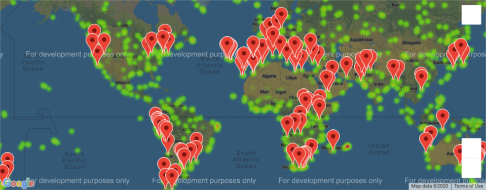

# Python API Challenge

## WeatherPy
The assignment utilizes Open Weather's API to gather weather statistics around the world to spot general trends. By sampling 600+ cities world-wide, we can apply see how a location's latitude affects factors such as: 
    - Temperature
    - Humidity
    - Cloudiness
    - Wind Speed

## Result

Skills Showcased: [Python, Pandas, NumPy, JSON,  Matplotlib, Data Visualization, Data Cleaning]
APIs Used: [Open Weather, Google Maps]