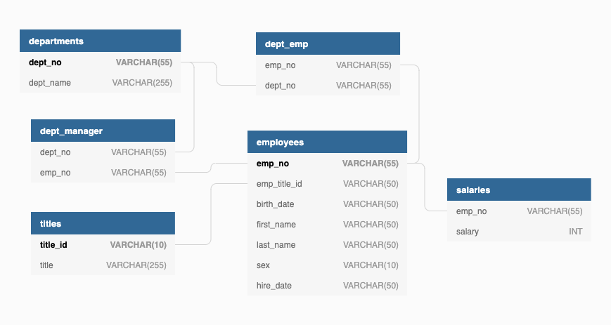

# SQL Challenge

This task used PostgreSQL to create several tables utilizing several keys to store information about a company's departments and employees to a database for easy access. The structure for the database can be seen below. See the queries used to create the tables <a href="EmployeeSQL/tables.sql">here</a>.

Utilizing this structure can efficiently store information and run queries to analyze various information. Examples of this analysis can be found <a href="EmployeeSQL/analysis.sql">here</a>.