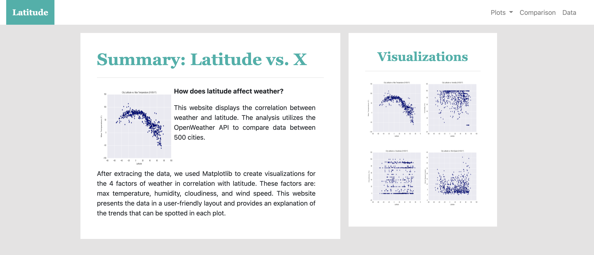

# Web-Design Challenge

This task used HTML and CSS to design a webpage that shows the correlation between latitude and weather around the world. The website provides simple navigation to compare and analyze the Matplotlib graphs produced.

This contains several pages to display the data set and each graph. See the home page below.

 

 
 

Skills Showcased: [HTML, CSS, Python, Matplotlib]